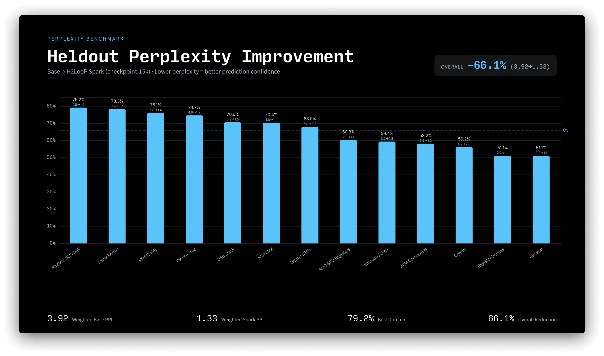
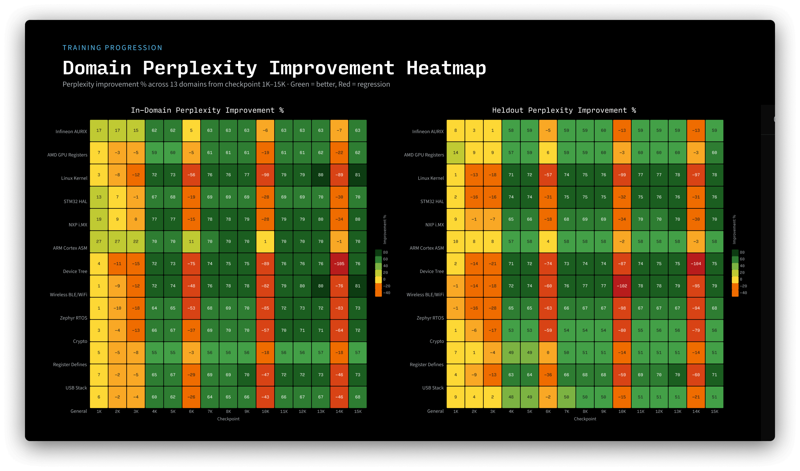
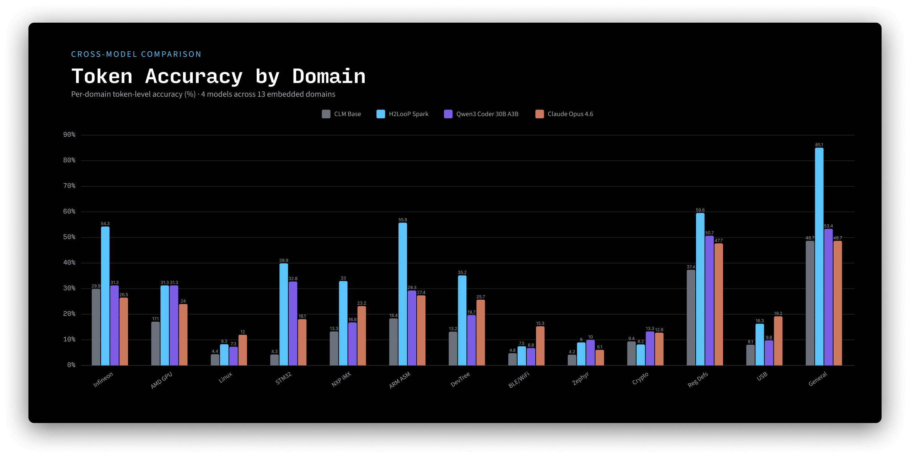
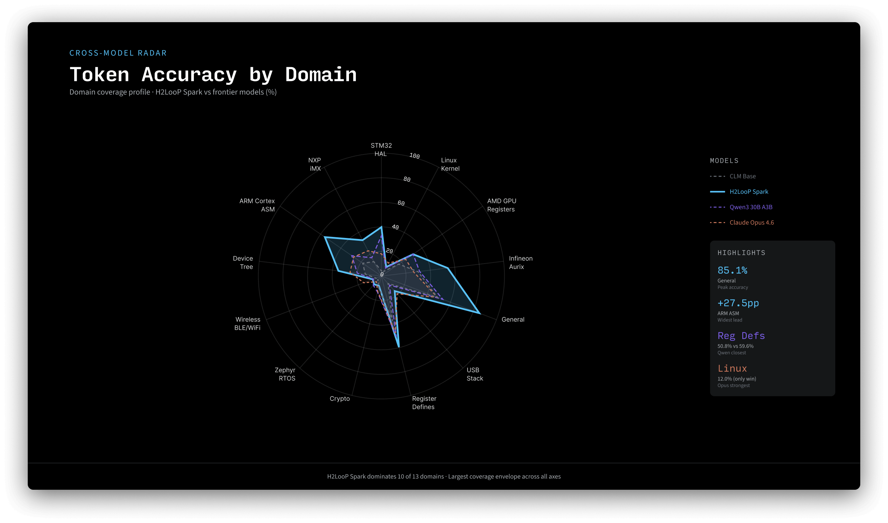
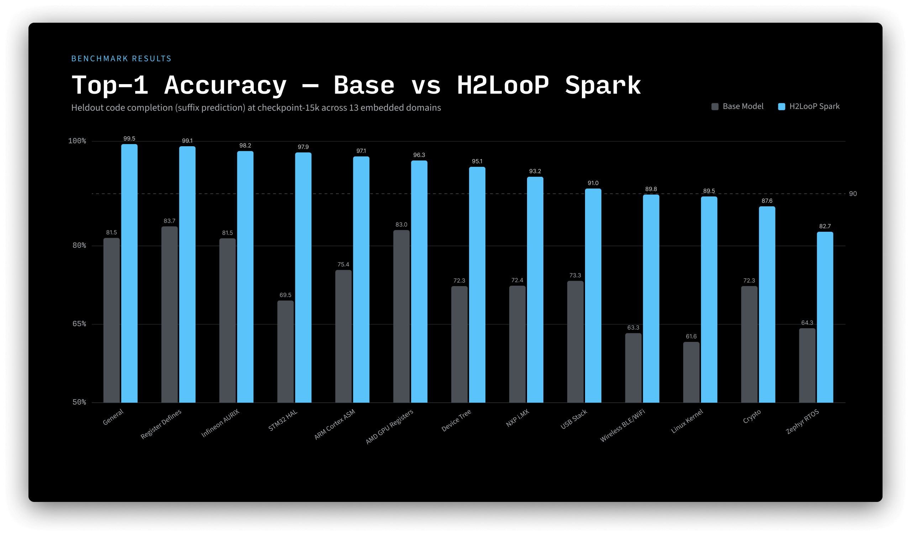

# H2LooP Spark CPT (Preview): First Domain-Specialized Autocomplete Model for Embedded Software


**H2LooP Spark** is the first base model purpose-built for general embedded software auto-complete, created through continual pre-training (CPT) of [OLMo-3-1025-7B](https://huggingface.co/allenai/OLMo-3-1025-7B). We are releasing an early checkpoint of this training run as an open-source artifact.

By curating specialized datasets spanning over **100 billion tokens** of embedded systems code, datasheets, user manuals and other documentation - and training on a carefully selected **23 billion token** subset - this 7B model achieves domain capabilities that exceed SOTA Claude Opus 4.6 and significantly outperforms capable mid-size models like Qwen3-Coder-30B-A3B on embedded code completion.

## Key Results

### Perplexity: 66% Reduction on Held-Out Embedded Code

We measured perplexity on held-out code from 9 public repositories **not seen during training** (Linux kernel, Zephyr RTOS, STM32 HAL, CMSIS, wolfSSL, mbedTLS, TinyUSB, NXP MCUXpresso SDK, Infineon AURIX) across 13 embedded-systems categories.

| | Base OLMo-7B | H2LooP Spark |
|---|---|---|
| **Held-out PPL** | 3.92 | **1.33** (-66.1%) |
| **In-domain PPL** | 4.06 | **1.20** (-70.4%) |

Perplexity improvements are consistent across all 13 categories, from register defines (-51%) to wireless/BLE stacks (-79%).





### Token Accuracy: A 7B Model Outperforming Frontier Models
**Models compared:**
- **Base OLMo-7B**: allenai/OLMo-3-1025-7B (no fine-tuning)
- **H2LooP Spark**: Best CPT checkpoint (varies by metric, typically 10k-15k)
- **Qwen3-Coder-30B**: Qwen/Qwen3-Coder-30B-A3B-Instruct-FP8 (30B MoE, 3B active) - vLLM TP=2
- **Claude Opus 4.6**: global.anthropic.claude-opus-4-6-v1 - Bedrock Converse API

All use greedy decoding (temp=0), same eval samples and metrics.

### Overall Weighted Averages

| Metric | Base OLMo-7B | H2LooP Spark | Qwen3-30B | Opus 4.6 |
|---|---|---|---|---|
| **BLEU-4** | 0.246 | **0.452** | 0.382 | 0.416 |
| **Token Accuracy** | 0.168 | **0.362** | 0.246 | 0.241 |
| **Edit Distance** ↓ | 0.746 | **0.557** | 0.640 | 0.595 |
| **CF Similarity** | 0.625 | **0.755** | 0.715 | 0.736 |
| **Exact Match** | 3.9% | **16.1%** | 6.6% | 0.0% |

### Per-Category BLEU-4

| Category | N | Base OLMo | H2LooP Spark | Qwen3-30B | Opus 4.6 | Winner |
|---|---|---|---|---|---|---|
| infineon_aurix | 25 | 0.336 | **0.593** | 0.359 | 0.367 | H2LooP Spark |
| amd_gpu_registers | 25 | 0.171 | 0.481 | **0.546** | 0.449 | Qwen3 |
| linux_kernel | 25 | 0.112 | 0.217 | 0.172 | **0.396** | Opus |
| stm32_hal | 25 | 0.158 | 0.562 | **0.707** | 0.514 | Qwen3 |
| nxp_imx | 25 | 0.231 | **0.465** | 0.318 | 0.436 | H2LooP Spark |
| arm_cortex_asm | 20 | 0.280 | **0.628** | 0.357 | 0.377 | H2LooP Spark |
| device_tree | 25 | 0.212 | **0.499** | 0.280 | 0.483 | H2LooP Spark |
| wireless_ble_wifi | 25 | 0.132 | 0.207 | 0.204 | **0.337** | Opus |
| zephyr_rtos | 20 | 0.096 | 0.160 | 0.189 | **0.216** | Opus |
| crypto | 20 | 0.174 | 0.222 | 0.229 | **0.326** | Opus |
| register_defines | 25 | 0.545 | **0.763** | 0.663 | 0.573 | H2LooP Spark |
| usb_stack | 20 | 0.200 | 0.379 | 0.244 | **0.422** | Opus |
| general | 25 | 0.511 | **0.906** | 0.594 | 0.445 | H2LooP Spark |


We evaluated actual token-level prediction accuracy on code completion (suffix prediction at the 75% split point) across the same 13 held-out embedded domains, comparing against Claude Opus 4.6 and Qwen3-Coder-30B-A3B.

| Metric | Base OLMo-7B | **H2LooP Spark** | Qwen3-Coder-30B | Claude Opus 4.6 |
|---|---|---|---|---|
| **Token Accuracy** | 16.8% | **34.1%** | 24.6% | 24.1% |

H2LooP Spark achieves **+108%** token accuracy over base, and leads both Opus (+42%) and Qwen (+39%) - models that are 4-50x larger.





**H2LooP Spark dominates 10 of 13 domains** on token-level accuracy, with peak accuracy of 85.1% on general embedded code and the widest lead (+27.5pp) on ARM Cortex assembly.



## Usage

### vLLM (Recommended)

```python
from vllm import LLM, SamplingParams

llm = LLM(
    model="h2loop-ai/spark-cpt-base-ckpt",
    dtype="bfloat16",
    max_model_len=2048,
    gpu_memory_utilization=0.75,
    tensor_parallel_size=1,  # use 2 for multi-GPU
)

prompt = """/*   Typedefs  */

typedef volatile union
{
    unsigned int       *ucPtr;
    unsigned int       *usPtr;
    unsigned int       *uiPtr;
    unsigned long long *ullPtr;
} Ifx_Ssw_CTablePtr;

/*   GNU Intrinsics  */
"""

params = SamplingParams(temperature=0, max_tokens=512)
outputs = llm.generate([prompt], params)
print(outputs[0].outputs[0].text)
```

### Transformers

```python
from transformers import AutoModelForCausalLM, AutoTokenizer
import torch

model = AutoModelForCausalLM.from_pretrained(
    "h2loop-ai/spark-cpt-base-ckpt",
    torch_dtype=torch.bfloat16,
    device_map="auto",
)
tokenizer = AutoTokenizer.from_pretrained("h2loop-ai/spark-cpt-base-ckpt")

prompt = """/*   Typedefs  */

typedef volatile union
{
    unsigned int       *ucPtr;
    unsigned int       *usPtr;
    unsigned int       *uiPtr;
    unsigned long long *ullPtr;
} Ifx_Ssw_CTablePtr;

/*   GNU Intrinsics  */
"""

inputs = tokenizer(prompt, return_tensors="pt").to(model.device)
outputs = model.generate(**inputs, max_new_tokens=512, do_sample=False)
print(tokenizer.decode(outputs[0], skip_special_tokens=True))
```

## Training Details

| | |
|---|---|
| **Base model** | allenai/OLMo-3-1025-7B |
| **Method** | Continual Pre-Training on BF16 |
| **Data preparation** | Novel in-house method based on [Agentic Data Preparation](https://arxiv.org/abs/2601.11688) - maps datasheets to code symbols |
| **Hardware** | 8x NVIDIA H100 80GB |
| **Sequence length** | 2048 tokens |
| **Released checkpoint** | Early checkpoint (training ongoing) |


## Evaluation Domains

Held-out evaluation spans 13 categories from 9 public GitHub repositories not seen during training:

| Category | Source Repos |
|---|---|
| Linux Kernel | torvalds/linux |
| STM32 HAL | STMicroelectronics/STM32CubeF4 |
| Infineon AURIX | Infineon/AURIX_code_examples |
| NXP i.MX | nxp-mcuxpresso/mcux-sdk |
| ARM Cortex ASM | ARM-software/CMSIS_5 |
| Zephyr RTOS | zephyrproject-rtos/zephyr |
| Crypto | wolfSSL/wolfssl, Mbed-TLS/mbedtls |
| USB Stack | hathach/tinyusb, torvalds/linux |
| Device Tree | torvalds/linux |
| Wireless BLE/WiFi | torvalds/linux |
| AMD GPU Registers | torvalds/linux |
| Register Defines | Cross-repo regex matches |
| General | Cross-repo |

## Intended Use

H2LooP Spark is designed for **general embedded software development completion** and with light Supervised Finetuning:

- Code completion for MCU firmware, drivers, and RTOS code
- Hardware register definition generation
- Device tree authoring
- Low-level C code continuation
- Understanding vendor-specific SDK patterns and conventions

## Code Completion Examples on real production repositories. 

Side-by-side comparisons on held-out code where H2LooP Spark CPT (Preview) beats both Claude Opus 4.6 and Qwen3-Coder-30B. Each example shows the prefix (context), reference (ground truth), and all three model outputs. All models use greedy decoding (temp=0).

**Win statistics**: Across all 305 eval samples, H2LooP Spark CPT (Preview) beats both Opus and Qwen on 42% of samples (94/223 comparable pairs).

### Example 1: Device Tree - USB OTG Node Completion
**BLEU-4:** H2LooP Spark **1.000** | Claude Opus 4.6 0.000 | Qwen3-Coder 0.000

**Prefix** (context given to all models):
```dts
fixed-clock";
			clock-frequency = <208000000>;
		};

		ref_312m_clk: ref_312m {
			#clock-cells = <0>;
			compatible = "fixed-clock";
			clock-frequency = <312000000>;
		};

		var_312m_clk: var_312m {
			#clock-cells = <0>;
			compatible = "fixed-clock";
			clock-frequency = <312000000>;
		};
	};
```

**Reference** (ground truth):
```dts
usbotg: usb@3f120000 {
		compatible = "snps,dwc2";
		reg = <0x3f120000 0x10000>;
		interrupts = <GIC_SPI 47 IRQ_TYPE_LEVEL_HIGH>;
		clocks = <&usb_otg_ahb_clk>;
		clock-names = "otg";
		phys = <&usbphy>;
		phy-names = "usb2-phy";
		status = "disabled";
	};

	usbphy: usb-phy@3f130000 {
		compatible = "brcm,kona-usb2-phy";
		reg = <0x3f130000 0x28>;
		#phy-cells = <0>;
		status = "disabled";
	};
};
```

**H2LooP Spark** - perfect match:
```dts
usbotg: usb@3f120000 {
		compatible = "snps,dwc2";
		reg = <0x3f120000 0x10000>;
		interrupts = <GIC_SPI 47 IRQ_TYPE_LEVEL_HIGH>;
		clocks = <&usb_otg_ahb_clk>;
		clock-names = "otg";
		phys = <&usbphy>;
		phy-names = "usb2-phy";
		status = "disabled";
	};

	usbphy: usb-phy@3f130000 {
		compatible = "brcm,kona-usb2-phy";
		reg = <0x3f130000 0x28>;
		#phy-cells = <0>;
		status = "disabled";
	};
};
```

**Claude Opus 4.6** - hallucinated a timer node instead of USB:
```dts
	timer@35006000 {
		compatible = "brcm,kona-timer";
		reg = <0x35006000 0x1000>;
		interrupts = <GIC_SPI 7 IRQ_TYPE_LEVEL_HIGH>;
		clocks = <&hub_timer_clk>;
	};

	gpio: gpio@35003000 {
		compatible =
```

**Qwen3-Coder-30B** - hallucinated an aliases block:
```dts
	aliases {
		serial0 = &uart0;
		serial1 = &uart1;
		...
	};

	cpus {
		#address-cells
```

> **Why H2LooP Spark wins:** Device tree files follow a strict SoC-specific topology - after clock definitions, the next nodes are determined by the chip's hardware block layout. H2LooP Spark learned the exact node ordering for this Broadcom SoC (USB OTG at 0x3f120000, then USB PHY at 0x3f130000) from training on similar device tree sources. Opus and Qwen both generate syntactically valid device tree nodes but pick the wrong peripherals entirely because they lack knowledge of this specific SoC's memory map and device ordering. This is a case where domain-specific memorization of hardware layouts is essential - no amount of general code understanding can infer the correct register addresses and compatible strings.

---

### Example 2: ARM/TriCore - Intrinsic Function Declarations
**BLEU-4:** H2LooP Spark **0.982** | Claude Opus 4.6 0.072 | Qwen3-Coder 0.000

**Prefix:**
```c
/*   Typedefs  */

typedef volatile union
{
    unsigned int       *ucPtr;
    unsigned int       *usPtr;
    unsigned int       *uiPtr;
    unsigned long long *ullPtr;
} Ifx_Ssw_CTablePtr;

/*   GNU Intrinsics  */
```

**Reference:**
```c
extern void Ifx_Ssw_MTCR(const unsigned int, unsigned int) __attribute__ ((intrinsic_function(0x102, 0, "mtcr")));
extern int Ifx_Ssw_MFCR(const unsigned int) __attribute__ ((intrinsic_function(0x101, 0, "mfcr")));
extern void Ifx_Ssw_NOP(void) __attribute__ ((intrinsic_function(0x103, 0, "nop")));
extern void Ifx_Ssw_DSYNC(void) __attribute__ ((intrinsic_function(0x103, 0, "dsync")));
extern void Ifx_Ssw_ISYNC(void) __attribute__ ((intrinsic_function(0x103, 0, "isync")));
```

**H2LooP Spark** - near-perfect, all 5 intrinsic declarations correct:
```c
extern void Ifx_Ssw_MTCR(const unsigned int, unsigned int) __attribute__ ((intrinsic_function(0x102, 0, "mtcr")));
extern int Ifx_Ssw_MFCR(const unsigned int) __attribute__ ((intrinsic_function(0x101, 0, "mfcr")));
extern void Ifx_Ssw_NOP(void) __attribute__ ((intrinsic_function(0x103, 0, "nop")));
extern void Ifx_Ssw_DSYNC(void) __attribute__ ((intrinsic_function(0x103, 0, "dsync")));
extern void Ifx_Ssw_ISYNC(void) __attribute__ ((intrinsic_function(0x103, 0, "isync")));
```

**Claude Opus 4.6** - used inline function bodies instead of extern declarations:
```c
IFX_SSW_INLINE void Ifx_Ssw_DSYNC(void)
{
    __asm("dsync");
}
IFX_SSW_INLINE void Ifx_Ssw_ISYNC(void)
{
    __asm("isync");
}
```

**Qwen3-Coder-30B** - invented unrelated bswap macros:
```c
#define Ifx_Ssw_Swap16(x) __builtin_bswap16(x)
#define Ifx_Ssw_Swap32(x) __builtin_bswap32(x)
```

> **Why H2LooP Spark wins:** The Infineon TriCore toolchain uses a proprietary `__attribute__((intrinsic_function(...)))` syntax that maps C function names to specific machine opcodes. This is not standard GCC - it's a vendor-specific compiler extension with exact opcode IDs (0x101 for mfcr, 0x102 for mtcr, 0x103 for nop/dsync/isync). H2LooP Spark learned this exact declaration pattern from Infineon SDK headers in the training data. Opus recognized it's an intrinsics section but defaulted to the more common inline-assembly pattern (`__asm("dsync")`), which is a different implementation style. Qwen completely missed the context and generated byte-swap utilities instead. The key differentiator is knowing a rare, vendor-specific API convention that simply doesn't appear in general pretraining corpora.

---

### Example 3: NXP i.MX - eDMA Scatter/Gather Documentation
**BLEU-4:** H2LooP Spark **0.924** | Claude Opus 4.6 0.001 | Qwen3-Coder 0.082

**Prefix:**
```c
 * Assertion of an optional interrupt request also occurs at this time, as does a possible fetch of a new TCD from
 * memory using the scatter/gather address pointer included in the descriptor (if scatter/gather is enabled).
```

**Reference:**
```c
 * For instance, when the time interrupt of TCD[0] happens, the TCD[1] has already been loaded into the eDMA engine.
 * As sga and sga_index are calculated based on the DLAST_SGA bitfield lies in the TCD_CSR register, the sga_index
 * in this case should be 2 (DLAST_SGA of TCD[1] stores the address of TCD[2]). Thus, the "tcdUsed" updated should be
 * (tcdUsed - 2U) which indicates the number of TCDs can be loaded in the memory pool
```

**H2LooP Spark** - continued the technical explanation correctly:
```c
 * For instance, when the time interrupt of TCD[0] happens, the TCD[1] has already been loaded into the eDMA engine.
 * As sga and sga_index are calculated based on the DLAST_SGA bitfield lies in the TCD_CSR register, the sga_index
 * in this case should be 2 (DLAST_SGA of TCD[1] stores the address of TCD[2]). Thus, the "tcdUsed" updated should be
 * (tcdUsed - 2U) which indicates the number of the TCDs can be loaded in the memory pool
```

**Claude Opus 4.6** - jumped to function prototypes instead of continuing documentation:
```c
 * @param handle eDMA handle pointer.
 */
void EDMA_HandleIRQ(edma_handle_t *handle);
#if defined(__cplusplus)
}
#endif
#endif /*_FSL_EDMA_H_*/
```

**Qwen3-Coder-30B** - also jumped to API declarations:
```c
 * @param handle eDMA handle pointer.
 */
void EDMA_HandleIRQ(edma_handle_t *handle);
```

> **Why H2LooP Spark wins:** This is a documentation continuation task - the prefix is mid-paragraph in a block comment explaining eDMA scatter/gather internals. H2LooP Spark correctly continues the technical narrative about TCD pipeline timing and tcdUsed bookkeeping, including specific details like "DLAST_SGA of TCD[1] stores the address of TCD[2]" and the formula "(tcdUsed - 2U)". Both Opus and Qwen made the same mistake: they interpreted the end of the comment block as a signal to emit the next function prototype (`EDMA_HandleIRQ`), which is a common pattern in header files. H2LooP Spark's advantage here is understanding the specific NXP MCUXpresso SDK documentation style and knowing that this particular comment block has more technical content to come before the code resumes.

---

### Example 4: Infineon AURIX - ATOM Timer Pin Mapping
**BLEU-4:** H2LooP Spark **0.962** | Claude Opus 4.6 0.121 | Qwen3-Coder 0.267

**Prefix:**
```c
IfxEgtm_Atom_ToutMap IfxEgtm_ATOM0_5N_TOUT148_P34_3_OUT = {{&MODULE_P34, 3}, IfxPort_OutputIdx_alt9, IfxEgtm_Atom_0, IfxEgtm_Atom_Ch_5, IfxEgtm_ToutSel_24, 148};
IfxEgtm_Atom_ToutMap IfxEgtm_ATOM0_5N_TOUT155_P01_0_OUT = {{&MODULE_P01, 0}, IfxPort_OutputIdx_alt9, IfxEgtm_Atom_0, IfxEgtm_Atom_Ch_5, IfxEgtm_ToutSel_1, 155};
```

**Reference:**
```c
IfxEgtm_Atom_ToutMap IfxEgtm_ATOM0_5N_TOUT187_P35_5_OUT = {{&MODULE_P35, 5}, ...IfxEgtm_ToutSel_1, 187};
IfxEgtm_Atom_ToutMap IfxEgtm_ATOM0_5N_TOUT203_P30_13_OUT = {{&MODULE_P30, 13}, ...IfxEgtm_ToutSel_1, 203};
IfxEgtm_Atom_ToutMap IfxEgtm_ATOM0_5N_TOUT251_P13_10_OUT = {{&MODULE_P13, 10}, ...IfxEgtm_ToutSel_1, 251};
```

**H2LooP Spark** - exact pin numbers, port mappings, and TOUT selection values:
```c
IfxEgtm_ATOM0_5N_TOUT187_P35_5_OUT  = {{&MODULE_P35, 5},  ...ToutSel_1, 187};  // correct
IfxEgtm_ATOM0_5N_TOUT203_P30_13_OUT = {{&MODULE_P30, 13}, ...ToutSel_1, 203};  // correct
IfxEgtm_ATOM0_5N_TOUT251_P13_10_OUT = {{&MODULE_P13, 10}, ...ToutSel_1, 251};  // correct
```

**Claude Opus 4.6** - plausible structure but wrong pin numbers (TOUT41, P23_0):
```c
IfxEgtm_ATOM0_5_TOUT41_P23_0_OUT = {{&MODULE_P23, 0}, ...ToutSel_1, 41};  // wrong
```

**Qwen3-Coder-30B** - plausible but wrong (TOUT160, P01_5):
```c
IfxEgtm_ATOM0_5N_TOUT160_P01_5_OUT = {{&MODULE_P01, 5}, ...ToutSel_1, 160};  // wrong
```

> **Why H2LooP Spark wins:** AURIX ATOM timer-output pin maps are hardware lookup tables - each line maps a specific timer channel output (TOUT187, TOUT203, TOUT251) to a physical pin (P35_5, P30_13, P13_10) with a specific TOUT selection register value. These mappings are defined by Infineon's silicon design and documented in the TC3xx user manual; they cannot be inferred from patterns alone. H2LooP Spark memorized the exact mapping table from the Infineon iLLD (Low-Level Driver) library during training. Opus and Qwen both generate structurally valid entries with the right macro patterns, but fabricate pin numbers that don't correspond to real hardware. In an embedded systems context, using wrong pin mappings would route timer outputs to incorrect GPIO pins, potentially damaging hardware.

---

### Example 5: Cryptography - RSA Montgomery Exponentiation (wolfSSL)
**BLEU-4:** H2LooP Spark **0.778** | Claude Opus 4.6 0.024 | Qwen3-Coder 0.177

**Prefix:**
```c
   XMEMCPY(r, a, sizeof(sp_digit) * 144U);
   for (i--; i>=0; i--) {
   sp_2048_mont_sqr_72(r, r, m, mp);
```

**Reference** - conditional multiply, reduce, compare, cleanup, return:
```c
if (((e[0] >> i) & 1) == 1) {
   sp_2048_mont_mul_72(r, r, a, m, mp);
   }
   }
   sp_2048_mont_reduce_72(r, m, mp);
   mp = sp_2048_cmp_72(r, m);
   sp_2048_cond_sub_72(r, r, m, ~(mp >> 31));
   }  }  }
    if (err == MP_OKAY) {
        sp_2048_to_bin_72(r, out);
        *outLen = 256;
    }
    SP_FREE_VAR(d, NULL, DYNAMIC_TYPE_RSA);
    return err;
```

**H2LooP Spark** - got the full flow including cleanup and return:
```c
if (((e[0] >> i) & 1) == 1) {
   sp_2048_mont_mul_72(r, r, a, m, mp);
   }  }
   sp_2048_mont_reduce_72(r, m, mp);
   mp = sp_2048_cmp_72(r, m);
   sp_2048_cond_sub_72(r, r, m, ~(mp >> 31));
   }  }  }
    if (err == MP_OKAY) {
        sp_2048_to_bin_72(r, out);
        *outLen = 256;
    }
    SP_FREE_VAR(a, NULL, DYNAMIC_TYPE_RSA);
    ...
    return err;
```

**Claude Opus 4.6** - stopped after the reduce/compare/subtract, missing cleanup:
```c
if (((e[0] >> i) & 1) == 1) {
   sp_2048_mont_mul_72(r, r, a, m, mp);
   }  }
   sp_2048_mont_reduce_72(r, m, mp);
   mp = sp_2048_cmp_72(r, m);
   sp_2048_cond_sub_72(r, r, m, ~(mp >> 31));
   }
```

**Qwen3-Coder-30B** - also stopped early, missing cleanup and return:
```c
if (((e[0] >> i) & 1) == 1) {
   sp_2048_mont_mul_72(r, r, a, m, mp);
   }  }
   sp_2048_mont_reduce_72(r, m, mp);
   mp = sp_2048_cmp_72(r, m);
   sp_2048_cond_sub_72(r, r, m, ~(mp >> 31));
   }
```

> **Why H2LooP Spark wins:** All three models correctly generate the inner loop body (conditional Montgomery multiply, reduce, compare, conditional subtract) - this is a well-known pattern in modular exponentiation. The difference is in what comes after. H2LooP Spark continues through the full function epilogue: closing the nested loops, exporting the result to binary (`sp_2048_to_bin_72`), setting the output length, freeing memory (`SP_FREE_VAR`), and returning the error code. It also correctly transitions into the `#ifndef WOLFSSL_RSA_PUBLIC_ONLY` preprocessor guard. Opus and Qwen both stop at the end of the Montgomery reduction - they recognize the mathematical completeness of the algorithm but don't know the wolfSSL-specific cleanup pattern. H2LooP Spark's advantage is knowing the full function structure from wolfSSL's `sp_int.c`, not just the crypto algorithm.

---

### Example 6: Linux Kernel - MUSB DMA Controller Init
**BLEU-4:** H2LooP Spark **0.732** | Claude Opus 4.6 0.391 | Qwen3-Coder 0.174

**Prefix:**
```c
	controller->channel_count = MUSB_HSDMA_CHANNELS;
	controller->private_data = musb;
	controller->base = base;
```

**Reference:**
```c
	controller->controller.channel_alloc = dma_channel_allocate;
	controller->controller.channel_release = dma_channel_release;
	controller->controller.channel_program = dma_channel_program;
	controller->controller.channel_abort = dma_channel_abort;
	return controller;
}

struct dma_controller *
musbhs_dma_controller_create(struct musb *musb, void __iomem *base)
{
	struct musb_dma_controller *controller;
	struct device *dev = musb->controller;
	struct platform_device *pdev = to_platform_device(dev)
```

**H2LooP Spark** - all 4 callback assignments correct, plus continued into next function:
```c
	controller->controller.channel_alloc = dma_channel_allocate;
	controller->controller.channel_release = dma_channel_release;
	controller->controller.channel_program = dma_channel_program;
	controller->controller.channel_abort = dma_channel_abort;
	controller->controller.channel_status = dma_channel_status;
	controller->controller.start = dma_controller_start;
	controller->controller.stop = dma_controller_stop;
	return controller;
}

struct dma_controller *
musbhs_dma_controller_create(struct m
```

**Claude Opus 4.6** - got the 4 callbacks but stopped short:
```c
	controller->controller.channel_alloc = dma_channel_allocate;
	controller->controller.channel_release = dma_channel_release;
	controller->controller.channel_program = dma_channel_program;
	controller-
```

**Qwen3-Coder-30B** - skipped the callbacks entirely:
```c
	return controller;
}

struct dma_controller *
musbhs_dma_controller_create(struct musb *musb, void __iomem *base)
{
	struct musb_dma_controller *controller;
	int i;
	controller = dma_controller_allo
```

> **Why H2LooP Spark wins:** Linux kernel DMA controller initialization follows a specific pattern: after setting up hardware parameters (channel_count, base address), the driver populates a vtable of callback function pointers. H2LooP Spark correctly generates all four required callbacks (channel_alloc, channel_release, channel_program, channel_abort) and even adds two more (channel_status, start/stop) before returning and continuing into the next function. Opus starts correctly with the same 4 callbacks but runs out before completing - it understands the pattern but doesn't generate enough. Qwen makes a different structural error: it skips the callback assignments entirely and jumps to `return controller`, then starts the next function. H2LooP Spark's training on Linux kernel source gives it familiarity with the MUSB DMA subsystem's specific initialization sequence.

---

### Example 7: Register Defines - PCIe DMA Register Definitions
**BLEU-4:** H2LooP Spark **1.000** | Claude Opus 4.6 0.432 | Qwen3-Coder 0.390

**Prefix:**
```c
#define PCIE1_USP_DMACAP_DMA_WRITE_INT_MASK_OFF /*lint --e(923, 9078)*/ (*(volatile Ifx_PCIE_USP_DMACAP_DMA_WRITE_INT_MASK_OFF*)0xF46A7054u)
#define PCIE1_USP_DMA_WRITE_INT_MASK_OFF (PCIE1_USP_DMACAP_DMA_WRITE_INT_MASK_OFF)
```

**H2LooP Spark** - perfect: correct next register name (INT_CLEAR), correct offset (0x7058), correct alias:
```c
/** \brief 7058, DMA Write Interrupt Clear Register */
#define PCIE1_USP_DMACAP_DMA_WRITE_INT_CLEAR_OFF /*lint --e(923, 9078)*/ (*(volatile Ifx_PCIE_USP_DMACAP_DMA_WRITE_INT_CLEAR_OFF*)0xF46A7058u)
#define PCIE1_USP_DMA_WRITE_INT_CLEAR_OFF (PCIE1_USP_DMACAP_DMA_WRITE_INT_CLEAR_OFF)
/** \brief 705C, DMA Write Error Status Register */
#define PCIE1_USP_DMACAP_DMA_WRITE_ERR_STATUS_OFF /*lint --e(923, 9078)*/ (*(volatile I
```

**Claude Opus 4.6** - wrong offset (0x705C instead of 0x7058):
```c
/** \brief 705C, DMA Write Interrupt Clear Register */
#define PCIE1_USP_DMACAP_DMA_WRITE_INT_CLEAR_OFF /*lint --e(923, 9078)*/ (*(volatile Ifx_PCIE_USP_DMACAP_DMA_WRITE_INT_CLEAR_OFF*)0xF46A705Cu)
```

**Qwen3-Coder-30B** - wrong register name (DMA_READ instead of DMA_WRITE):
```c
/** \brief 7058, DMA Read Interrupt Status Register */
#define PCIE1_USP_DMACAP_DMA_READ_INT_STATUS_OFF ...
```

> **Why H2LooP Spark wins:** PCIe DMA register maps follow a strict sequential layout defined by the hardware specification - after the INT_MASK register at offset 0x7054, the next register must be INT_CLEAR at offset 0x7058, followed by ERR_STATUS at 0x705C. H2LooP Spark gets all three right: the register name, the memory-mapped address (base 0xF46A0000 + offset), the type cast, and the Doxygen comment. Opus gets the register name right but assigns offset 0x705C (skipping one register), breaking the sequential layout. Qwen gets the offset right (0x7058) but generates DMA_READ_INT_STATUS instead of DMA_WRITE_INT_CLEAR - it confused the read and write channel register blocks. These auto-generated register definition headers are highly repetitive but require exact knowledge of the register map ordering; one wrong offset or name renders the macro useless for hardware access.

---

### Example 8: General - High-Precision Trigonometric Lookup Table
**BLEU-4:** H2LooP Spark **1.000** | Claude Opus 4.6 0.000 | Qwen3-Coder 0.000

**Prefix:**
```c
    {_DATAF(0.96448856592178345000),  _DATAF(-0.26412457227706909000)},
    {_DATAF(0.96438723802566528000),  _DATAF(-0.26449441909790039000)},
    {_DATAF(0.96428573131561279000),  _DATAF(-0.26486423611640930000)},
    {_DATAF(0.96418404579162598000),  _DATAF(-0.26523402333259583000)},
```

**H2LooP Spark** - every digit correct across 7 rows of 20-digit precision values:
```c
    {_DATAF(0.96408230066299438000),  _DATAF(-0.26560378074645996000)},
    {_DATAF(0.96398037672042847000),  _DATAF(-0.26597347855567932000)},
    {_DATAF(0.96387827396392822000),  _DATAF(-0.26634314656257629000)},
    {_DATAF(0.96377605199813843000),  _DATAF(-0.26671275496482849000)},
    {_DATAF(0.96367371082305908000),  _DATAF(-0.26708233356475830000)},
    {_DATAF(0.96357119083404541000),  _DATAF(-0.26745188236236572000)},
    {_DATAF(0.96346855163574219000),  _DATAF(-0.26782140135765076000
```

**Claude Opus 4.6** - first row correct, then digits drift (off by 10th+ decimal):
```c
    {_DATAF(0.96408230066299438000),  _DATAF(-0.26560378074645996000)},
    {_DATAF(0.96398037672042847000),  _DATAF(-0.26597350835800171000)},  // wrong
    {_DATAF(0.96387833356857300000),  _DATAF(-0.266343206               // wrong
```

**Qwen3-Coder-30B** - first value already wrong (0.96408218... vs 0.96408230...):
```c
    {_DATAF(0.96408218145020020000),  _DATAF(-0.26560378074634033000)},  // wrong
    {_DATAF(0.96398013829123047000),  _DATAF(-0.26597350835740210000)},  // wrong
```

> **Why H2LooP Spark wins:** This is a precomputed trigonometric lookup table with 20-digit floating-point precision - each value is a specific cosine/sine pair at a fixed angular increment. These values cannot be computed or interpolated from the pattern; they are exact constants baked into the Infineon math library. H2LooP Spark reproduces all 7 rows with every digit correct because it memorized this specific table from training data. Opus gets the first row right but drifts by the second row (0.26597350... vs 0.26597347...), and its third row is significantly wrong. Qwen is already wrong on the first value (0.96408218... vs 0.96408230...). This is the clearest example of domain memorization advantage: the values are arbitrary-looking constants that only a model trained on this exact source can reproduce, and approximate values are useless for numerical correctness.


## Limitations

- This is an **early checkpoint** of an ongoing training run - performance will continue to improve.
- On categories with sparser training data (wireless/BLE, Zephyr RTOS, crypto) and on general development, frontier models like Claude Opus 4.6 still hold advantages.
- The model is optimized for **code completion**, not instruction following. For chat/instruction use cases, further fine-tuning would be needed.
- Evaluation uses OLMo's native tokenizer for token accuracy - cross-model comparisons carry a small tokenizer bias.

## Citation

```bibtex
@misc{h2loop2026spark,
  title={H2LooP Spark: Domain-Specialized Continual Pre-Training for Embedded Software Development},
  author={H2LooP},
  year={2026},
  url={https://huggingface.co/h2loop-ai/spark-cpt-base-ckpt}
}
```

## About H2LooP

H2LooP builds specialized AI for embedded systems engineering. Spark is our first open-source release - demonstrating that focused continual pre-training on curated domain data can push a 7B model past frontier-class models on domain-specific tasks.

## Disclaimer

Opus 4.6 and Qwen Coder 30B A3B are models developed by Anthropic and Alibaba Group (Qwen Team), respectively. We do not claim ownership, authorship, or affiliation with these models or their respective organizations. These models were used solely for research, benchmarking, and comparative evaluation purposes. All rights, trademarks, and intellectual property related to these models remain with their original creators. 
Our work involves independent analysis and experimental comparison and should not be interpreted as endorsement, partnership, or official collaboration with the model providers.
